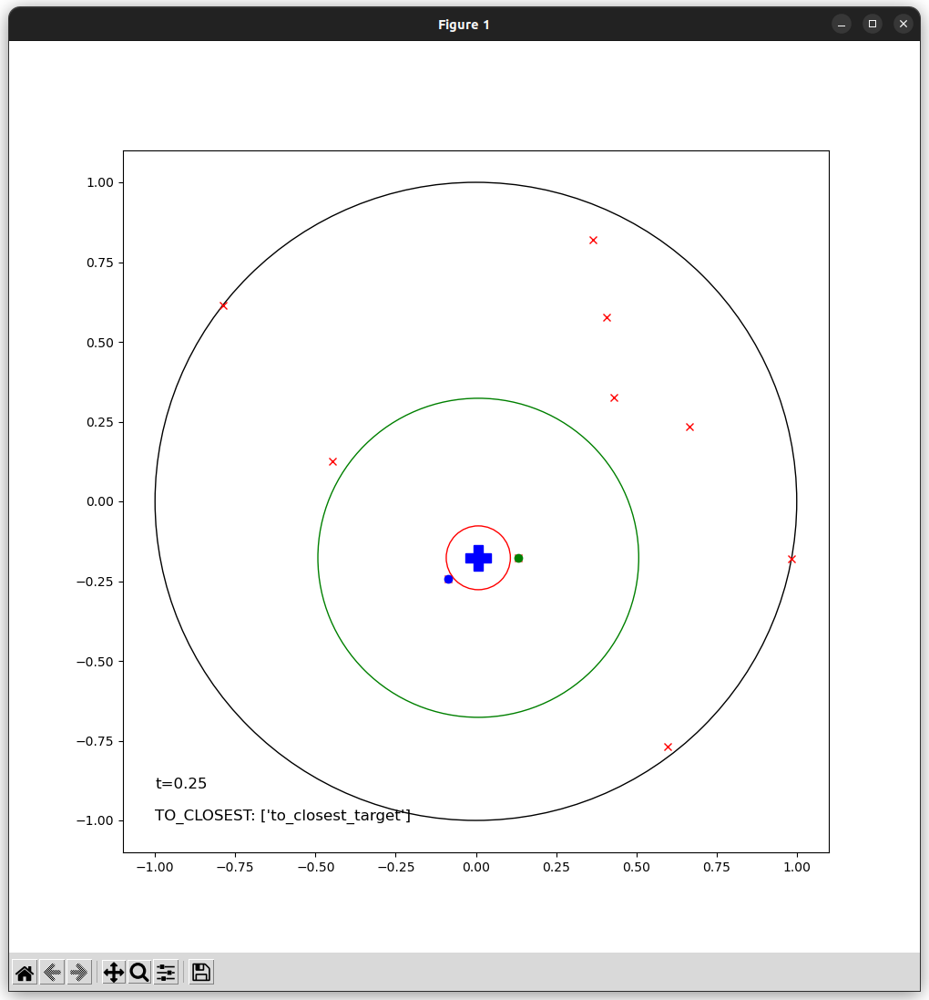

* 参考手册开启软件和编辑器
* 完成题目：
    * 一台地面移动机器人初始在原点，在以原点为圆心的1m为半径的圆内存在N个任务点，但机器人只能观测到**距离小于0.5m**的目标点，当机器人距离一个任务点距离小于0.1m则视为完成目标，你需要设计一个决策树，来完成对所有目标点的覆盖。
    * 你可以使用如下节点来完成决策树的设计：
      * 判断节点
        * 判断当前观测范围内是否存在目标点
        * 判断当前机器人X坐标大于某值
        * 判断当前机器人X坐标小于某值
        * 判断当前机器人Y坐标大于某值
        * 判断当前机器人Y坐标小于某值
      * 执行节点
        * 以某坐标为目标，向其运动
        * 以最近可观测的任务点为目标，向其运动
```python
# 所有可用的节点信息如下：
# 
# judgement condition : 
# - have_targets
# - x_larger_than, Value
# - x_smaller_than, Value
# - y_larger_than, Value
# - y_smaller_than, Value

# action:
# - to_point, x, y
# - to_closest_target
```
* 你只需要使用编辑器（vscode）对`strategy.py`文件进行编辑，完成决策树的设计。
* 你可以运行`sim.exe`进行测试，测试界面如下：
  * 图中的蓝色十字标识为机器人，围绕机器人的绿色圆圈为0.5m的机器人观测范围，红色圆圈为0.1m的目标点完成范围。图中的红色点为目标点，蓝色点为机器人观测到的目标点，绿色点为机器人已经完成的目标点。
  
  * `sim.exe`会依据随机种子运行十次地图，每次的地图都是随机生成的，你需要确保你的决策树能够在所有地图上都能够完成任务。每个地图的最长测试时间为20s，每次结束会记录时间以及覆盖的目标点数量。最终测试时，需要在`strategy.py`中将seed设置为现场随机出的种子，确保所有人的测试环境一致。测试完成后会生成一个results-xxx.gz的文件，作为测试结果。

## 参考资料：

**决策树**：决策树是一种利用树形结构来完成决策生成的工具。一颗决策树由根节点/判断节点/执行节点三部分组成。如图所示为一个“周末做什么”的决策树。图中胶囊形状为判断节点，矩形为执行节点。决策树通过在树状结构的前序搜索完成决策。例如在途中，如果第一个判断“是否阳光明媚”为否，则顺次执行“是否多云”的判断，如果确实是多云，则先判断“是否有风”，如果此时判断为否即今日无风，则进入“是否多云的第二个节点”-公园散步。值得注意的是，决策树的每次决策，最终都会落在决策节点上最终实现决策生成。

  

对于上面的决策树，可以转化成代码，实现如下：
```python
# ROOT - 今天天气是否阳光明媚 - 出门野餐
#      - 今天是否多云 - 今天是否有风 - 公园放风筝
#                   - 公园散步
#      - 在家玩游戏
DECISION_TREE = [
    {
        "ID": "节点一",
        "Type": "Judgement",
        "Arguments": ["今天天气是否阳光明媚"]
        "Children": [
            {
                "ID": "节点一",
                "Type": "Action",
                "Arguments": ["出门野餐"]
            }
        ]
    },
    {
        "ID": "节点二",
        "Type": "Judgement",
        "Arguments": ["今天是否多云"]
        "Children": [
            {
                "ID": "节点三",
                "Type": "Judgement",
                "Arguments": ["今天是否有风"]
                "Children": [
                    {
                        "ID": "节点四",
                        "Type": "Action",
                        "Arguments": ["公园放风筝"]
                    },
                    {
                        "ID": "节点五",
                        "Type": "Action",
                        "Arguments": ["公园散步"]
                    }
                ]
            }
        ]
    },
    {
        "ID": "节点六",
        "Type": "Action",
        "Arguments": ["在家玩游戏"]
    }
]
```
让我们解释一下上面的代码：
* 上述代码中出现了三种参数类型，分别为`字符串`，`列表`，`字典`。
    * 字符串是""中的内容，例如`"节点一"`，`"今天天气是否阳光明媚"`。
    * 列表是[]中的内容，例如`["今天天气是否阳光明媚"]`。
    * 字典是{}中的内容，例如`{"ID": "节点一", "Type": "Judgement", "Arguments": ["今天天气是否阳光明媚"]}`。
* 整个参数是一个列表，是由多个节点`（类型：字典）`组成。无论是判断节点还是执行节点，都有ID，Type，Arguments。ID`（类型：字符串）`是节点的唯一标识方便调试，Type`（类型：字符串）`是节点的类型，Arguments`（类型：列表）`是节点的参数。
* 对于执行节点，Type为`'Judgement'`，Arguments`类型是一个列表`，是执行的动作和动作所需要的参数。
* 对于判断节点，Type为`'Action'`，Arguments`类型是一个列表`是判断的条件，Children是一个列表，是该判断节点的子节点，最终形成嵌套递归。

